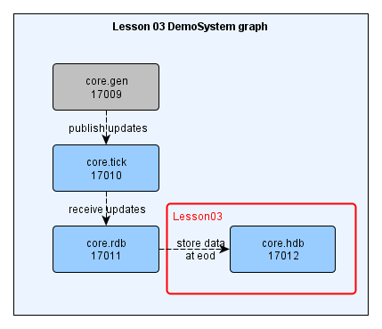
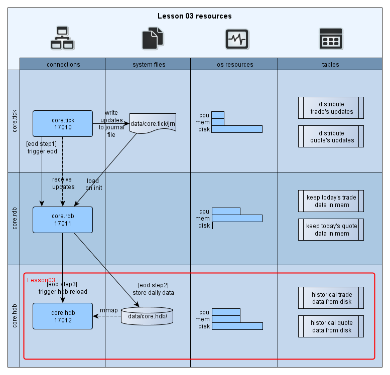
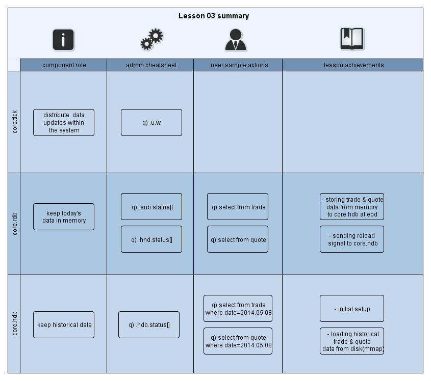

[:arrow_backward:](../Lesson02) | [:arrow_forward:](../Lesson04)
<!----------------- https://github.com/exxeleron/enterprise-components/tree/master/tutorial/Lesson03 ------------------>

#                                          **Lesson 3 - Storing data in `hdb`**

<!--------------------------------------------------------------------------------------------------------------------->
## Goal of the lesson

From [Lesson 2](../Lesson02) we have a system which is generating data and pushing it to `rdb` (tables `trade` and `quote`).
The aim of this Lesson is to add new component (`hdb`) and use it to store historical data (`trade` and `quote` tables).

<!--------------------------------------------------------------------------------------------------------------------->
## Prerequisites

It is assumed that [Installation](../Installation.md) page is read, system is deployed and working. 
Specifically these sections should be looked at in more detail:
- [System installation](../Installation.md#demosystem-installation)
- [System startup](../Installation.md#demosystem-startup)
- [Switching Lessons](../Installation.md#changing-demosystem-lesson)

<!--------------------------------------------------------------------------------------------------------------------->
## Components used

In this lesson we will expand system from [Lesson 2](../Lesson02/README.md#components-used) with `hdb`:

- `core.hdb` - allows to store data from memory (`rdb`) on disk



> Note:

> Although `core.gen` is still used it has been grayed out as is no longer required in explaining how the system works; 
as such it is also omitted in the graph below ([Resources in the system](README.md#resources-in-the-system)).

<!--------------------------------------------------------------------------------------------------------------------->
## Resources in the system



<!--------------------------------------------------------------------------------------------------------------------->
## Configuration files

Our configuration files can be found in `ec/tutorial/Lesson03/etc`. If you recall 
from previous lessons, adding component requires us to include its details 
in `system.cfg` file. `dataflow.cfg` on the other hand needs to be updated 
to show what's happening with the data.

### `system.cfg`

In [Lesson 1](../Lesson01) we've already seen how components are created: 
by adding relevant sub-sections (or parameters) for each component. 
It's no different in this case - including `hdb` is simply done by adding few lines:

```diff
--- system.cfg     (Lesson 2)
+++ system.cfg     (Lesson 3)
   1. [group:core]                   
   2.                                
   3.   [[core.gen]]                 
   4.     command = "q gen.q"        
   5.     type = q:mock/gen          
   6.     port = ${basePort} + 9     
   7.     memCap = 5000              
   8.     cfg.dst = core.tick        
   9.                                
  10. [[core.tick]]                  
  11.   command = "q tickHF.q"       
  12.   type = q:tickHF/tickHF       
  13.   port = ${basePort} + 10      
  14.   memCap = 5000                
  15.                                
  16.  [[core.rdb]]                  
  17.    command = "q rdb.q"         
  18.    type = q:rdb/rdb             
  19.    port = ${basePort} + 11     
  20.    memCap = 10000              
  21.                                
+ 22.  [[core.hdb]]                   # Component named 'core.hdb'
+ 23.                                 #       historical database
+ 24.    command = "q hdb.q"          # command line string to start q process 
+ 25.    type = q:hdb/hdb             # q component of type 'hdb' from package 'hdb' 
+ 26.    port = ${basePort} + 12      # q process port, based on ${basePort}  
+ 27.    memCap = 10000               # q process memory cap in MB (-w q option)
```

### `dataflow.cfg`

Since data flow is extended (from data generator to `tick`, `rdb` and finally to `hdb`) we also need 
to update `dataflow.cfg` file. Let's compare template definition from [Lesson 2](../Lesson02) 
with the same section from file `dataflow.cfg` for this lesson:

```diff
--- dataflow.cfg     (Lesson 2)
+++ dataflow.cfg     (Lesson 3)
   1. [template:marketData]
   2. 
   3.   [[core.gen]]
   4.     period = 5000
   5.     pkgSize = 10
   6.
   7.   [[core.tick]]
   8.
   9.   [[core.rdb]]                  # Collect intraday updates for trade table
  10.     subSrc = core.tick          # source server for the data - pointing to core.tick
- 11.     hdbConn = NULL              # no hdb in current system setup
+ 11.     hdbConn = core.hdb          # store the data in core.hdb  
  12.     eodClear = TRUE             # clear trade table at the end of the day
- 13.     eodPerform = FALSE          # don't store tables at the end of the day  
+ 13.     eodPerform = TRUE           # store tables at the end of the day
  14.
+ 15.   [[core.hdb]]                  # Hdb component - keeping historical data
```

Important lines in this snippet are:
- `11` - where we specify which component is our historical database
- `13` - where we say that end of day processing should take place 
- `15` - where `hdb` is defined
   
<!--------------------------------------------------------------------------------------------------------------------->
## Using the system

### Check subscription status
  
```q
q)/ execute on process core.rdb, port 17011
q) .sub.status[]
tab   | name  | src       | subProtocol     | srcConn | rowsCnt
------+-------+-----------+-----------------+---------+-------- 
quote | quote | core.tick | PROTOCOL_TICKHF | open    | 3280
trade | trade | core.tick | PROTOCOL_TICKHF | open    | 660
```
    
> Hint:

> Please pay attention to number of rows in these tables (column `rowsCnt`), 
we will come back to those later
    
### Manually trigger artificial end of day action

```q
q)/ execute on process core.tick, port 17010
q) .u.end[.z.d]
::  
```

> Note:

> End of day processing in its simplest form means that data from `core.rdb` 
will be moved (or written) on disk to `core.hdb` with yesterdays' date

### Check subscription status again

```q
q)/ execute on process core.rdb, port 17011
q) .sub.status[]
tab   | name  | src       | subProtocol     | srcConn | rowsCnt
------+-------+-----------+-----------------+---------+-------- 
quote | quote | core.tick | PROTOCOL_TICKHF | open    | 250
trade | trade | core.tick | PROTOCOL_TICKHF | open    | 50
```

> Hint:

> Compare number of rows with table where function `sub.status[]` was called. 
`rowsCnt` are smaller - why?

This indicates that data from `core.rdb` was moved to `core.hdb` 
and now `core.rdb` is in the process of gathering new set of data.

### Check `hdb` tables after end of day

```q
q)/ execute on process core.hdb, port 17012
q) tables[]
quote
trade
```

### Check `hdb` tables status

```q
q)/ execute on process core.hdb, port 17012
q) .hdb.status[] 
tab   | format     | rowsCnt | err |  columns    
------+------------+---------+-----+---------------------------------------------
quote | PARITIONED | 3570    |     | `date `sym `time `bid `bidSize `ask `askSize
trade | PARITIONED | 720     |     | `date `sym `time `price `size
```

### Check `hdb` tables after eod

```q
q)/ execute on process core.hdb, port 17012
q) select count i by date from quote
date       | x
-----------+------
2014.05.08 | 3570
q) select count i by date from trade
date       | x
-----------+-----
2014.05.08 | 720
```

### Check content of `core.hdb` subdirectory

```bash
DemoSystem> ls -l log/core.hdb/
  core.hdb_2014.05.08T09.13.57.env
  core.hdb_2014.05.08T09.13.57.err
  core.hdb.2014.05.08T09.13.57.log
  core.hdb_2014.05.08T09.13.57.out
  current.log -> core.hdb.2014.05.08T09.13.57.log
  init.log -> core.hdb.2014.05.08T09.13.57.log
```

### Check if `DemoSystem/data/core.hdb` contains `hdb` data
  
```bash
DemoSystem> ls -l data/core.hdb/
  2014.05.08
  sym
```

<!--------------------------------------------------------------------------------------------------------------------->
## Summary



<!--------------------------------------------------------------------------------------------------------------------->
[:arrow_backward:](../Lesson02) | [:arrow_forward:](../Lesson04)

<sub>[Super Mono Icons](http://files.softicons.com/download/toolbar-icons/super-mono-sticker-icons-by-double-j-design/readme.txt) 
by [Double-J Design](http://www.doublejdesign.co.uk/) / [CC BY 3.0](http://creativecommons.org/licenses/by/3.0/)</sub>
